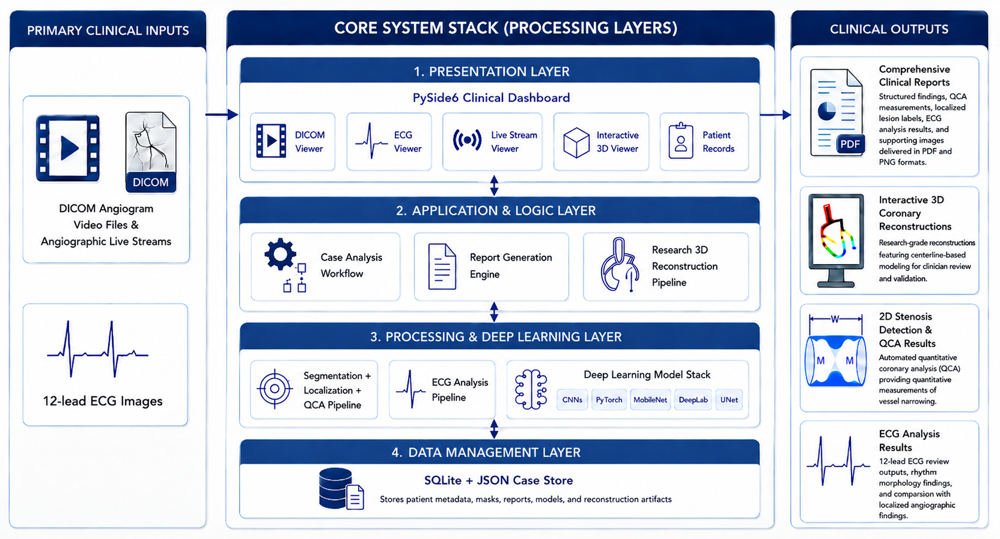

# Cardexa Clinical AI System

**Cardexa** is a research grade clinical AI system built inside the `angio-ai` repository. It focuses on coronary angiography analysis by combining DICOM angiogram review, real-time vessel segmentation, coronary lesion localization, Quantitative Coronary Analysis (QCA), ECG review, clinical report generation, and experimental 3D coronary artery reconstruction.

The goal of the system is to support clinician assisted analysis of angiographic data by showing where vessels are, where possible stenosis regions are located, how severe narrowing may be and how findings can be reviewed through 2D reports and interactive 3D visualization.

> **Research disclaimer:** Cardexa is currently a research and prototyping system. It is not a certified medical device and must not be used as an independent diagnostic tool. All AI outputs require qualified clinical review.

## Main Capabilities

- DICOM coronary angiogram loading and review
- Real-time angiographic live stream analysis
- Vessel segmentation using deep learning models
- Coronary anatomical lesion localization
- 2D stenosis detection and QCA measurements
- ECG image review and ECG/angiogram comparison support
- Patient intake and local patient record management
- Structured clinical report generation
- Interactive 3D coronary reconstruction viewer
- Research grade 3D reconstruction from multi view angiographic DICOM clips
- Confidence colored 3D artery meshes for validation and review

## System Architecture

Cardexa is organized as a layered clinical AI system:



## Project Structure

```text
angio-ai/
  src/
    clinical_app/                  Main PySide6 Cardexa clinical dashboard
    frame_pipeline.py               Shared frame preprocessing, inference, localization and QCA flow
    qca.py                          Vessel cleanup, branch analysis, stenosis metrics and QCA visualization
    localization.py                 Lesion-to-anatomy localization logic
    localization_labels.py          Coronary/SYNTAX anatomical label definitions
    ecg_segment.py                  ECG segmentation and analysis support
    report_engine.py                Report and clinical visualization generation

  scripts/
    auto_select_dicom_views.py      Automatic DICOM view/frame selection
    dicom_3d_pipeline.py            Two-view hybrid coronary 3D reconstruction
    epipolar_optimized_centerline.py  Epipolar branch validation and centerline optimization
    smooth_junction_mesh.py         Smoothed, junction-aware mesh generation
    recolor_smoothed_tree_by_confidence.py   Confidence coloring for reconstructed meshes
    run_full_3d_reconstruction.py   End-to-end experimental 3D reconstruction runner

  checkpoints/                      Trained segmentation/localization model checkpoints
  ECG/                              ECG-related project data
  anatomy_prior/                    Coronary anatomy prior resources
  exports/                          Generated reports and exported results
  requirements.txt                  Python dependencies for the full system
```

## Key Pipelines

### 1. DICOM Angiogram Analysis Pipeline

The DICOM analysis pipeline loads angiographic clips, extracts frames, preprocesses images, runs vessel segmentation, analyzes the cleaned vessel mask, detects candidate stenosis regions and stores structured per-view results.

Typical flow:

```text
DICOM clip
  -> frame extraction
  -> preprocessing
  -> vessel segmentation
  -> mask cleanup
  -> centerline and branch extraction
  -> QCA stenosis analysis
  -> lesion localization
  -> overlays and report outputs
```

### 2. Vessel Segmentation Pipeline

The segmentation pipeline identifies coronary vessel pixels from angiographic images or live stream frames. It uses trained ONNX/PyTorch models and produces binary vessel masks, overlays and cleaned masks for downstream QCA.

The segmentation result is the foundation for:

- stenosis detection
- QCA measurement
- vessel centerline extraction
- branch analysis
- 3D reconstruction
- visual report generation

### 3. Lesion Localization Pipeline

The localization pipeline assigns detected lesions to coronary anatomy. It answers the clinical question: where is the narrowing located?

Typical localized outputs include:

- artery family such as LAD, LCX, RCA, LM, PDA
- anatomical group such as proximal LAD, mid LAD, distal RCA, OM/intermediate
- localization confidence
- lesion label used in reports and comparison views

Localization improves the usefulness of QCA by connecting numerical stenosis measurements to anatomical coronary territories.

### 4. QCA and Stenosis Analysis Pipeline

The QCA pipeline estimates vessel narrowing from segmentation masks and centerline geometry. It analyzes vessel diameter variation, identifies candidate lesion points, estimates diameter stenosis percentage, and prepares lesion-level visual outputs.

Typical QCA outputs include:

- minimum lumen diameter estimate
- reference vessel diameter estimate
- diameter stenosis percentage
- lesion severity category
- lesion overlays
- diameter profile visualizations

### 5. ECG Analysis Pipeline

The ECG workflow supports 12 lead ECG image review and comparison with angiographic findings. It is intended to help connect ECG territory information with localized coronary lesions.

Typical flow:

```text
ECG image
  -> ECG review/segmentation support
  -> territory or morphology interpretation support
  -> comparison with localized angiographic lesions
  -> report ready ECG/angiogram summary
```

### 6. Research 3D Coronary Reconstruction Pipeline

The 3D reconstruction pipeline is experimental. It reconstructs coronary artery tree geometry from multiple angiographic DICOM views when suitable views are available.

Typical flow:

```text
multi-view DICOM angiograms
  -> view/frame selection
  -> vessel segmentation
  -> centerline extraction
  -> branch matching
  -> epipolar validation
  -> 3D centerline reconstruction
  -> QCA radius estimation
  -> tube mesh generation
  -> smoothing and junction repair
  -> confidence coloring
  -> interactive 3D viewer
```

Confidence coloring is used because not every branch has the same geometric reliability:

- **Gray/white:** stronger two-view validated branch
- **Blue:** usable geometry-supported branch
- **Orange:** estimated or visually preserved branch

Orange branches should be treated as research/visual estimates not clinically validated 3D anatomy.

### 7. Report Generation Pipeline

The report pipeline gathers outputs from segmentation, localization, QCA, ECG review and 3D reconstruction modules. It generates structured clinical review artifacts such as PNG figures, visual summaries and PDF style reports.

Reports are designed to support doctor review, not replace doctor interpretation.

## Getting Started

Recommended Python version: **Python 3.10+**

### 1. Clone The Repository

```bash
git clone https://github.com/Samadhi-Kandewela/angio-ai.git
cd angio-ai
```

### 2. Create A Virtual Environment

```bash
python -m venv .venv
```

### 3. Activate The Virtual Environment

Windows PowerShell:

```powershell
.\.venv\Scripts\activate
```

Windows Command Prompt:

```cmd
.venv\Scripts\activate.bat
```

Linux / macOS:

```bash
source .venv/bin/activate
```

### 4. Install Project Dependencies

```bash
pip install -r requirements.txt
```

### 5. Launch The Cardexa Clinical Dashboard

```bash
python .\src\clinical_app\main.py
```

### 6. Open The Application

Cardexa is a desktop clinical dashboard. After running the launch command, the application window should open on your machine.

## Model Checkpoints

The system expects trained model checkpoints under:

```text
checkpoints/
```

## Current Limitations

- The system is research-grade and not clinically certified.
- Segmentation quality strongly affects every downstream result.
- Localization requires a valid localization model checkpoint.
- QCA measurements should be reviewed by a clinician.
- Single-view angiography cannot produce clinically reliable depth.

## Limitations And Future Work For 3D Reconstruction

Current 3D reconstruction limitations:

1. Angiogram views are captured at different time points, not at the exact same instant.
2. The heart is beating, so the same coronary artery can shift position between views.
3. Even with similar cardiac-phase selection, vessel shape and location may not perfectly match.
4. Respiratory motion and patient movement can introduce additional misalignment.
5. Poor contrast, motion blur, and vessel overlap can reduce segmentation and matching quality.

Future work should focus on better cardiac-phase selection, motion compensation, improved vessel segmentation, stronger branch matching, and doctor-validated multi-view reconstruction.

## Clinical Disclaimer

Cardexa is a research and development system. It is not approved for independent clinical diagnosis, treatment planning or emergency decision making.
